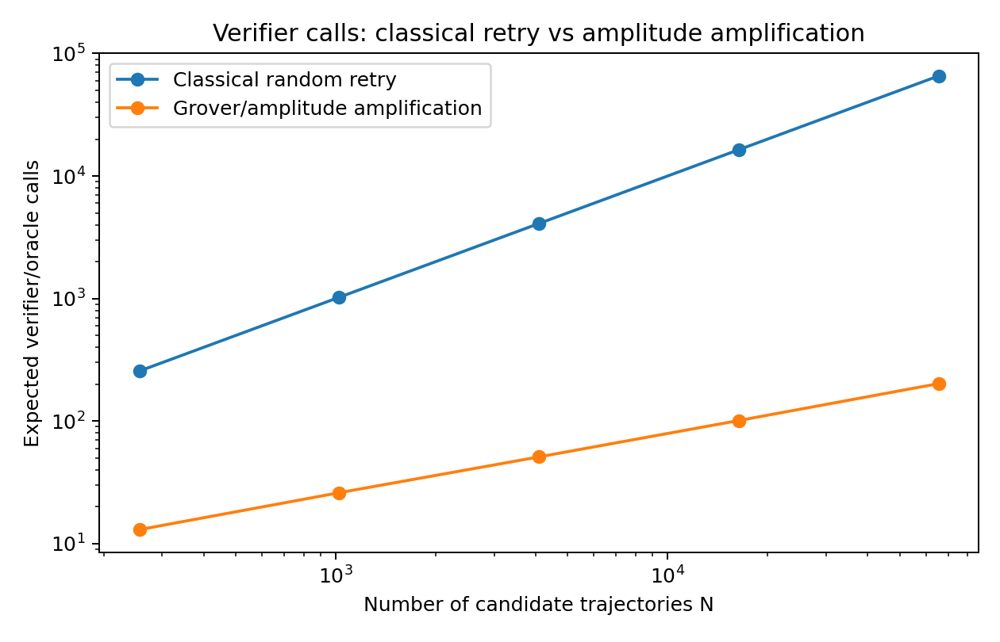
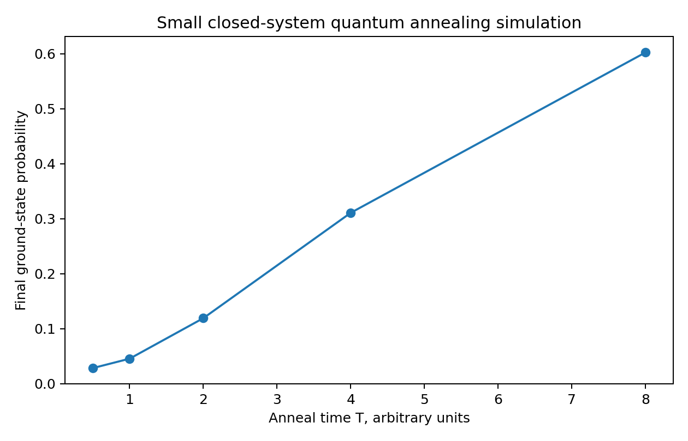

# 検証可能なAIイテレーションのための量子支援ハーネス：振幅増幅とアニーリングによる候補探索

**著者**: Mojofull Furoku  
**所属**: なし  
**Email**: mojofull.furoku@gmail.com  
**日付**: 2026年4月26日  
**版**: 日本語最新版。英語arXiv提出版と著者情報・数値結果・コード・参考文献を同期。

## 要旨

大規模言語モデル（LLM）エージェントは、計画、ツール利用、生成、テスト、修復、再試行という反復によってタスクを解くことが多い。しかし各ステップに非ゼロの失敗確率がある場合、長いタスクでは失敗が累積し、再試行コストも大きくなる。本稿は、AIエージェントの1回のイテレーションを、候補軌跡 $x \in X$ の探索問題として扱い、機械的検証器 $V(x)$ が成功候補を印付けるという狭いが有用な定式化を検討する。

理想的なコヒーレント・オラクルを仮定できる場合、Grover探索および振幅増幅は、成功候補を見つける検証器呼び出しコストを、ランダム再試行の $O(1/p)$ から $O(1/\sqrt{p})$ に下げる。ここで $p$ は候補生成器が成功候補に割り当てる確率質量である。また、成功条件をペナルティとして表せる場合、同じ枠組みをQUBOまたはIsing目的関数に写像し、アニーリング型探索として扱える。

本稿では、CPUのみで再現可能な実験ハーネスを提供する。内容は、状態ベクトルGroverシミュレーション、ランダム再試行ベースライン、構造化QUBO検証器、古典的シミュレーテッドアニーリング、小規模な閉鎖系量子アニーリング・シミュレーションである。$N=65,536$ 個の候補に成功候補が1個だけある場合、古典ランダム再試行の期待検証回数は $65,536$ 回である。一方、Groverシミュレーションでは成功確率 $0.999988$ に到達し、期待検証/オラクル呼び出し回数は約 $202.0$ 回となった。18ビットQUBO検証器では、262,144候補中76個がゼロエネルギー状態であり、ランダム再試行では期待 $3,449.3$ 回が必要になるが、古典的シミュレーテッドアニーリングは500回すべてでゼロエネルギー候補を発見した。8ビット閉鎖系アニーリング・シミュレーションでは、アニーリング時間を0.5から8.0に増やすと、最終基底状態確率が0.0285から0.6025へ増加した。

これらの結果は、現在の量子ハードウェア上で量子優位を実証するものではない。示しているのは、量子探索プリミティブがAIハーネス設計に入り得る条件である。すなわち、タスクが離散化でき、機械的に検証可能であり、検証器ハッキングに耐える必要がある。また、コヒーレント実装とハードウェア制約は依然として大きな障壁である。

## 1. 序論

LLMを基盤にしたAIエージェントは、計画、ツール呼び出し、成果物生成、テスト、修復、再試行という反復で能力を高める。しかしこの方式は、失敗の累積という問題を持つ。タスクが $L$ 個の壊れやすいステップを必要とし、各ステップの成功確率を $q$ とすると、単純な独立モデルではタスク全体の成功率はおおよそ $q^L$ になる。たとえば $q=0.95$ でも、100ステップをエラーなしで完了する確率は約0.0059にすぎない。実際のエージェントは独立ベルヌーイ列ではないが、この例は、長いエージェント・ワークフローには、自由生成だけではなく、足場、テスト、ロールバック、検証が必要であることを示す。

現在のハーネスエンジニアリングは、モデルの周囲に外部構造を置くことで失敗を減らしている。具体的には、指示、ツールインターフェース、状態管理、ユニットテスト、バリデータ、再試行方針などである。AnthropicのSkillsフレームワークは、タスク固有の指示、スクリプト、リソースを必要時に読み込む例である。SWE-benchのようなソフトウェア工学ベンチマークも、機械的に確認可能な結果の重要性を示している。候補パッチはもっともらしさではなく、実際の課題をテストで解決できるかによって評価される。

本稿が問うのは、このような機械的検証が存在する場合に、量子探索プリミティブが信頼性の高いAI反復のコストを下げられるかである。主張は、量子コンピュータがAIの失敗を消すというものではなく、また現在の量子ハードウェアがLLMや大規模エージェントループを実行できるというものでもない。より狭い主張は、エージェントループの一部を、検証可能な候補探索問題として切り出せる場合があるということである。

候補生成器が成功確率 $p$ で候補を生成し、検証器が成功を印付けできるなら、理想的なオラクルモデルではGrover探索と振幅増幅により、問い合わせ回数に二乗加速が得られる。成功をエネルギーまたはペナルティとして表せるなら、QUBOやIsing定式化により、アニーリング型最適化にも接続できる。

本稿の貢献は次の4点である。

1. AIエージェントのイテレーションを、検証可能な候補探索に写像する形式化を与える。
2. 理想的な振幅増幅、QUBO/アニーリング定式化、現在のハードウェア制約を区別する。
3. スケーリング則を確認し、具体的なベースラインを出す再現可能なCPU実験を提供する。
4. 古典的ハーネスから、小規模な量子またはハイブリッド実証へ進む研究ロードマップを示す。

## 2. 問題定式化

$X$ を候補エージェント軌跡の有限集合とする。候補は、コードパッチ、ツール呼び出し列、証明スケッチ、計画、離散スケジュールなどを表し得る。機械的検証器を次で表す。

$$
V:X \rightarrow \{0,1\}
$$

ここで $V(x)=1$ は、候補がタスクの受理基準を満たすことを意味する。成功候補数、候補総数、成功率を次のように置く。

$$
M = |\{x \in X: V(x)=1\}|, \quad N=|X|, \quad p=M/N
$$

一様サンプリングの場合はこの $p$ が成功確率である。より一般には、候補生成器 $A$ が $X$ 上に分布を誘導する場合、$p$ は成功候補に割り当てられた確率質量である。

古典的ランダム再試行では、$V(x)=1$ になるまで候補をサンプリングする。独立サンプルを仮定すれば、検証器呼び出し回数の期待値は次である。

$$
\mathbb{E}[C_{\mathrm{classical}}]=\frac{1}{p}
$$

これは成功がまれな場合の失敗累積ボトルネックそのものである。検証器が高コストであったり、候補空間が大きかったりすると、再試行が支配的なコストになる。

量子設定では、あるアルゴリズム $A$ が次の状態を準備すると仮定する。

$$
A|0\rangle = \sqrt{a}|\psi_{\mathrm{good}}\rangle + \sqrt{1-a}|\psi_{\mathrm{bad}}\rangle
$$

ここで $a$ は準備された分布における成功確率である。$V$ を、良い状態に位相反転を与えるコヒーレントなオラクルとして実装できるなら、振幅増幅は $O(1/\sqrt{a})$ 回の $A$、$A^{-1}$、オラクルの適用で良い状態を得る。一様な場合、これは標準的な $O(\sqrt{N/M})$ のGroverスケーリングになる。

同じ検証器は、エネルギー関数 $E:X\rightarrow\mathbb{R}_{\ge 0}$ として表せる場合もある。低エネルギーほど違反制約が少なく、$E(x)=0$ を成功とする。$x$ をビット列として符号化できるなら、二次制約なし二値最適化（QUBO）の目的関数は次のように書ける。

$$
E(x)=x^TQx+c^Tx+\mathrm{const.}
$$

これはIsingハミルトニアンに写像できる。アニーリング型手法は、低エネルギー状態をサンプルしようとする。

### 表1: AIハーネス概念と量子探索概念の対応

| AIハーネス概念 | 探索問題での表現 | 量子探索での類似物 |
|---|---|---|
| 候補計画・パッチ・ツール軌跡 | $x\in X$ | 基底状態または重ね合わせ |
| ユニットテスト・型検査・証明検査器 | 検証器 $V(x)$ | オラクル / 位相反転 |
| 反復再試行 | ランダムサンプリング | $O(1/p)$ の問い合わせコスト |
| 成功増幅 | 候補選択のバイアス | 振幅増幅 |
| 制約ペナルティ | エネルギー $E(x)$ | QUBO / Isingハミルトニアン |
| 最良の検証済み候補 | 低エネルギーまたは良い状態 | アニーリングサンプル / 測定 |

## 3. この定式化に合うAIタスク

この定式化が有用なのは、成功を機械的に確認できる場合である。適した例は次のとおりである。

- コード生成：ユニットテスト、統合テスト、型検査、静的解析で確認できる場合。
- 定理証明：proof checker が最終成果物を検証できる場合。
- スケジューリング、経路探索、資源割当：明示的な制約がある場合。
- 有界な設計探索：測定可能なコストと制約違反がある場合。
- エージェント計画：ゴール状態をシミュレーションまたは形式検査できる場合。

一方、成功が主観的または遅延的なタスクでは、この定式化は弱くなる。たとえば、文章品質、製品戦略、ユーザー満足、後にならないと真偽が分からない科学仮説などである。学習済み報酬モデルを代理検証器として使うことはできるが、その場合は報酬モデルの誤りや検証器ハッキングのリスクを継承する。したがって中心的なボトルネックは、量子ハードウェアだけではなく、信頼できる検証器の設計である。

## 4. アルゴリズム

### 4.1 Grover / 振幅増幅ハーネス

理想化したハーネスは次の手順である。

1. 候補 $x\in X$ をビット列として符号化する。
2. ユニタリ $A$ により候補分布を準備する。
3. $V(x)$ をコヒーレントな位相オラクルとして実装する。
4. 振幅増幅を適用する。
5. 候補を測定する。
6. 測定された候補を通常の古典的検証器で再確認する。

最後の古典的再確認は重要である。現実のAI設定では、量子測定結果をそのまま信頼するのではなく、通常の検証器で再検証する必要がある。量子部分は候補発見の確率を高める役割であり、最終的な受理判定は古典的検証で行う。

### 4.2 QUBO / アニーリングハーネス

ペナルティ型ハーネスでは、検証器を次の形に分解する。

$$
E(x)=\sum_i \lambda_i g_i(x)^2
$$

ここで $g_i(x)=0$ は各制約を満たすことを意味する。二値変数で二次式に落とせるならQUBOになる。そうでない場合は、補助変数や高次項の二次化が必要になる。

アニーリングは大域最適性を保証する万能手段ではない。低エネルギー状態にバイアスされた構造的サンプラーである。したがって、貪欲探索、シミュレーテッドアニーリング、SAT/SMT、整数計画、モンテカルロ木探索などの強い古典的ベースラインと比較する必要がある。

## 5. 実験方法

すべての実験はCPUのみで行い、1本のPythonスクリプト `quantum_agent_search_experiment.py` に実装した。NumPy、SciPy、Matplotlibを使用し、量子SDKや実機量子ハードウェアは使用していない。乱数シードは `20260425` である。ソースコードと固定出力は補助ファイルとして同梱する。

### 5.1 実験A: 状態ベクトルGroverシミュレーション

$n\in\{8,10,12,14,16\}$ 量子ビット、成功数 $M\in\{1,4,16\}$ について、ランダムな成功集合を選び、Grover反復を明示的にシミュレーションした。最適反復回数は次である。

$$
r=\mathrm{round}\left(\frac{\pi}{4\arcsin\sqrt{M/N}}-\frac{1}{2}\right)
$$

成功確率の解析式は次である。

$$
P_{\mathrm{succ}}(r)=\sin^2\left((2r+1)\arcsin\sqrt{M/N}\right)
$$

古典ランダム再試行は、成功確率 $p=M/N$ の幾何分布からサンプリングした。

### 5.2 実験B: QUBO検証器と古典的シミュレーテッドアニーリング

18ビットの玩具検証器は、計画ビット、選択アクションビット、検証ビットを持つエージェント軌跡を模す。ゼロエネルギーは全制約を満たすことを意味する。

- ビット0-5は接頭辞 `[1,0,1,1,0,0]` と一致する。
- ビット6-11のHamming weightは2である。
- ビット12-17のHamming weightは3である。
- ビット6と12、ビット7と13が一致する。

エネルギーは違反の二乗和である。スクリプトは全 $2^{18}$ 状態を総当たり列挙して真の基底状態数を求め、その後、ビット反転提案と指数温度スケジュールを持つ古典的シミュレーテッドアニーリングを500回実行した。

### 5.3 実験C: 小規模な閉鎖系量子アニーリング・シミュレーション

8ビットのアニーリング実験では、次を構成した。

$$
H(s)=(1-s)H_0+sH_P
$$

ここで $H_0=-\sum_i X_i$ は横磁場ドライバであり、$H_P$ は8ビットQUBOエネルギーを対角成分に持つ問題ハミルトニアンである。初期状態は一様重ね合わせである。時間発展はSciPyの `expm_multiply` で近似した。アニーリング時間 $T\in\{0.5,1,2,4,8\}$、時間ステップ数160で、最終基底状態確率を測定した。

### 5.4 ユニットテスト

スクリプトには4つのユニットテストを含めた。

1. 状態ベクトルGrover確率が解析式と一致する。
2. $N=256, M=1$ で最適Grover反復回数が成功確率0.95超を与える。
3. 18ビットQUBOのゼロエネルギー状態が検証器制約を満たす。
4. 閉鎖系アニーリング・シミュレーションが状態ノルムを保存する。

4件すべてのテストが成功した。

## 6. 結果

### 6.1 Grover問い合わせスケーリング

単一成功候補の場合、古典的再試行の期待コストは $N$ として増える。一方、Grover側の検証器/オラクル呼び出し推定値はおおむね $\sqrt{N}$ として増える。

### 表2: 単一成功探索（$M=1$）

| $n$ | $N$ | 古典期待回数 | $r$ | Grover成功確率 | 量子期待回数 |
|---:|---:|---:|---:|---:|---:|
| 8 | 256 | 256.0 | 12 | 0.999947 | 13.001 |
| 10 | 1,024 | 1,024.0 | 25 | 0.999461 | 26.014 |
| 12 | 4,096 | 4,096.0 | 50 | 0.999945 | 51.003 |
| 14 | 16,384 | 16,384.0 | 100 | 1.000000 | 101.000 |
| 16 | 65,536 | 65,536.0 | 201 | 0.999988 | 202.002 |



$N=65,536, M=1$ では、ランダム再試行は期待 $65,536$ 回の検証を必要とする。Groverシミュレーションは $r=201$ 回の反復を使い、成功確率 $0.999988$ に到達し、期待検証/オラクル呼び出し回数は約 $202.0$ 回となった。問い合わせ削減係数は約 $324.4$ である。

### 表3: 複数成功探索（$M=16$）

| $n$ | $N$ | 古典期待回数 | 量子期待回数 | 削減係数 |
|---:|---:|---:|---:|---:|
| 8 | 256 | 16.0 | 4.161 | 3.85 |
| 10 | 1,024 | 64.0 | 7.024 | 9.11 |
| 12 | 4,096 | 256.0 | 13.001 | 19.69 |
| 14 | 16,384 | 1,024.0 | 26.014 | 39.36 |
| 16 | 65,536 | 4,096.0 | 51.003 | 80.31 |

複数成功候補の場合も、$N/M$ と $\sqrt{N/M}$ の対応関係が確認できる。

### 6.2 QUBO検証器とシミュレーテッドアニーリング

18ビットQUBOでは、262,144候補中76個がゼロエネルギー状態である。ランダム成功率は0.0002899であり、期待ランダム試行回数は3,449.3回である。古典的シミュレーテッドアニーリングは500回すべてでゼロエネルギー状態を発見し、成功までのステップ数の中央値は293であった。

### 表4: 構造化18ビットQUBO検証器

| 指標 | 値 |
|---|---:|
| 候補ビット数 | 18 |
| 候補数 | 262,144 |
| ゼロエネルギー状態数 | 76 |
| ランダム成功率 | 0.0002899 |
| ランダム期待試行回数 | 3,449.3 |
| シミュレーテッドアニーリング実行数 | 500 |
| シミュレーテッドアニーリング成功率 | 1.000 |
| 成功までの中央値ステップ | 293 |
| 平均最良エネルギー | 0.000 |

この実験が示す実務上のポイントは、受理条件を制約として表せるなら、候補探索は盲目的な再試行ではなく構造を利用できるということである。量子アニーラーが強い古典的ベースラインを上回るかどうかは、別途の実証問題である。

### 6.3 閉鎖系量子アニーリング・シミュレーション

8ビットアニーリング・シミュレーションでは、アニーリング時間を長くすると最終基底状態確率が増加し、期待エネルギーが低下した。

### 表5: 小規模閉鎖系量子アニーリング・シミュレーション

| アニーリング時間 $T$ | 基底状態確率 | 期待エネルギー | ノルム誤差 |
|---:|---:|---:|---:|
| 0.5 | 0.028523 | 2.824789 | 2.22e-16 |
| 1.0 | 0.045663 | 2.420634 | 2.22e-16 |
| 2.0 | 0.119312 | 1.712687 | 0.00 |
| 4.0 | 0.310914 | 1.017029 | 0.00 |
| 8.0 | 0.602547 | 0.468370 | 0.00 |



この結果は、ゆっくりしたスケジュールほど低エネルギー状態へ確率が集中しやすいという断熱的直観と整合する。ただし、大規模な実機ハードウェア性能を予測するものではない。

## 7. 考察

実験から分かる限定的な主張は3つである。

第一に、AIイテレーションを検証可能な候補探索として抽象化すると、振幅増幅の問い合わせ則がシミュレーション上で直接現れる。第二に、成功条件を制約ペナルティへ分解できる場合、検証器を目的関数へ変換し、構造化探索手法で利用できる。第三に、閉鎖系アニーリング力学は、同じ目的関数を量子力学的な低エネルギー探索モデルへ接続する。

一方で、本実験は現在の量子コンピュータがLLMエージェントを高速化することを示していない。障壁は複数ある。振幅増幅にはコヒーレントな検証器が必要であり、通常のPythonテストスイートをそのまま量子オラクルにすることはできない。現在のLLM推論は大規模な古典計算であり、素朴にコヒーレントオラクルへ埋め込むのは現実的ではない。近い将来にあり得る利用形態は、古典的LLMが限定された候補集合や制約モデルを生成し、その縮小問題上で古典または量子最適化を使う形である。

検証器の品質も中心的である。検証器は不完全、誤り、またはゲーム可能であり得る。ユニットテストはバグを見逃し得る。証明義務は前提を漏らし得る。報酬モデルは攻略され得る。量子探索は、検証器が「良い」と印付けたものを増幅する。そのため、検証器の成功だけでなく、検証器設計の誤りも増幅し得る。

最後に、アニーリングには一般に大域最適解を効率的に見つける保証はない。ハードウェア実装には、ノイズ、温度、係数精度、マイナー埋め込み、チェーン切れ、校正ドリフト、読み出し誤差がある。ゲート型振幅増幅には、回路深さと耐故障量子計算の要件がある。

## 8. 研究ロードマップ

現実的な研究経路は4段階である。

**Stage 1: 古典的な検証可能ハーネス。** コーディングタスク、証明検査タスク、スケジューリング問題など、機械的検証器を持つタスクを集める。pass@k、検証器コスト、偽陽性、偽陰性を測定する。ランダム再試行、ビームサーチ、モンテカルロ木探索、SAT/SMT、整数計画、シミュレーテッドアニーリングを比較する。

**Stage 2: 量子シミュレーション。** 可能な範囲で小規模なコヒーレント検証回路を作る。制約タスクではペナルティをQUBOまたはIsing形式へ変換する。状態ベクトルGrover、固定点探索、テンソルネットワーク・シミュレーション、閉鎖系アニーリングを古典的ベースラインと比較する。

**Stage 3: 小規模ハードウェア実証。** ゲート型デバイス上で小さなGroverまたは振幅増幅例を実行し、アニーリングハードウェア上で小さなQUBOを実行する。問い合わせ複雑性だけでなく、ショット数、回路深さ、埋め込みオーバーヘッド、ノイズ、壁時計時間コストを測定する。

**Stage 4: ハイブリッドAIエージェント。** LLMに候補空間、制約、修復操作を提案させる。生成された離散構造の中を最適化器で探索する。最後は必ず独立した古典的検証器で確認し、失敗を制約モデルへフィードバックする。

## 9. 限界とリスク

**成功オラクルの構成。** 多くのAIタスクには信頼できる二値成功述語がない。この枠組みは、独立に設計された検証器があるタスクで最も強い。

**コヒーレントオラクルの構成。** 振幅増幅には、コヒーレントな $A$、$A^{-1}$、$V$ が必要である。これは通常のPythonテストスイートがあることよりはるかに強い条件である。

**検証器ハッキング。** 検証器が不完全なら、探索プロセスはユーザーの真の目的を満たさず、検証器だけを通過する候補を見つける可能性がある。

**ベンチマーク過適合。** 公開ベンチマークは汚染または過剰最適化され得る。検証可能ハーネス研究では、可能であれば非公開、動的、または生成型のタスクを使うべきである。

**コスト会計。** 問い合わせ複雑性は、状態準備、コンパイル、誤り訂正、I/Oコストを隠し得る。将来の優位性主張では、強い古典的ベースラインに対して、エンドツーエンドの壁時計時間とエネルギーコストを報告する必要がある。

## 10. 結論

量子計算は、AIの失敗を魔法のように消すものではない。しかし、AIタスクを機械的に検証可能な候補探索問題に変換できるなら、量子探索プリミティブがハーネスに入る明確な場所がある。理想的なオラクルモデルでは、振幅増幅は検証器問い合わせコストを二次的に削減できる。また、QUBO/Ising定式化は、構造化された検証をアニーリング型最適化に接続する。

再現可能なCPU実験は、ハードウェア上の量子優位ではなく、この定式化を支持するものである。最大のGroverシミュレーションでは、期待問い合わせ回数がランダム検証の $65,536$ 回から、理想的振幅増幅の約 $202$ 回へ下がった。QUBO実験では、制約構造によって盲目的再試行が不要になることを示した。小規模アニーリング・シミュレーションでは、アニーリング時間が長いほど基底状態確率が増加した。

したがって中心的な未解決問題は、単に量子ビットを増やすことではない。AIタスク、ハーネス、検証器を、離散的で、信頼でき、ゲームされにくく、探索オラクルまたはエネルギー関数として十分安価な形に設計することである。

## 再現性とコード公開

補助ファイルには、Python実験スクリプト、JSON/CSV出力、requirementsファイルが含まれる。実験を再現するには、次を実行する。

```bash
python3 quantum_agent_search_experiment.py --out results --test
```

必要環境は Python >= 3.10、NumPy、SciPy、Matplotlib である。期待されるユニットテスト要約は、4件実行、失敗0、エラー0である。

## AI支援の開示

著者は、原稿作成、編集、コード整理、パッケージングの補助ツールとして GPT-5.5 Pro を使用した。著者は、原稿、ソースコード、数値結果、参考文献、arXivメタデータを確認し、最終提出内容に責任を負う。

## 謝辞

外部資金または追加の謝辞は報告されていない。

## 参考文献

1. Lov K. Grover. *A Fast Quantum Mechanical Algorithm for Database Search*. STOC 1996.
2. Gilles Brassard, Peter Hoyer, Michele Mosca, Alain Tapp. *Quantum Amplitude Amplification and Estimation*. Contemporary Mathematics, 2002.
3. Theodore J. Yoder, Guang Hao Low, Isaac L. Chuang. *Fixed-Point Quantum Search with an Optimal Number of Queries*. Physical Review Letters, 2014.
4. Edward Farhi, Jeffrey Goldstone, Sam Gutmann, Michael Sipser. *Quantum Computation by Adiabatic Evolution*. arXiv:quant-ph/0001106, 2000.
5. Tameem Albash, Daniel A. Lidar. *Adiabatic Quantum Computation*. Reviews of Modern Physics, 2018.
6. Andrew Lucas. *Ising Formulations of Many NP Problems*. Frontiers in Physics, 2014.
7. D-Wave Systems. *QUBOs and Ising Models*. D-Wave Documentation, accessed 2026-04-25.
8. D-Wave Systems. *What is Quantum Annealing?* D-Wave Documentation, accessed 2026-04-25.
9. IBM Quantum. *Which Problems Are Quantum Computers Good For?* IBM Quantum Learning, accessed 2026-04-25.
10. Anthropic. *The Complete Guide to Building Skills for Claude*. Anthropic Resources, 2026, accessed 2026-04-25.
11. Carlos E. Jimenez et al. *SWE-bench: Can Language Models Resolve Real-World GitHub Issues?* arXiv:2310.06770, 2023.
12. OpenAI. *Introducing SWE-bench Verified*. 2024, accessed 2026-04-25.
13. X. Deng et al. *SWE-Bench Pro: Can AI Agents Solve Long-Horizon Software Engineering Tasks?* arXiv:2509.16941, 2025.

## 同期済みファイル

本日本語版は、次の最新版データと同期している。

- 英語arXiv提出版PDF/LaTeXソース。
- Python実験コード `quantum_agent_search_experiment.py`。
- 固定結果 `results.json` およびCSV出力。
- 図 `grover_query_scaling.png`、`quantum_annealing_ground_probability.png`。
- 著者情報: Mojofull Furoku、所属なし、mojofull.furoku@gmail.com。
